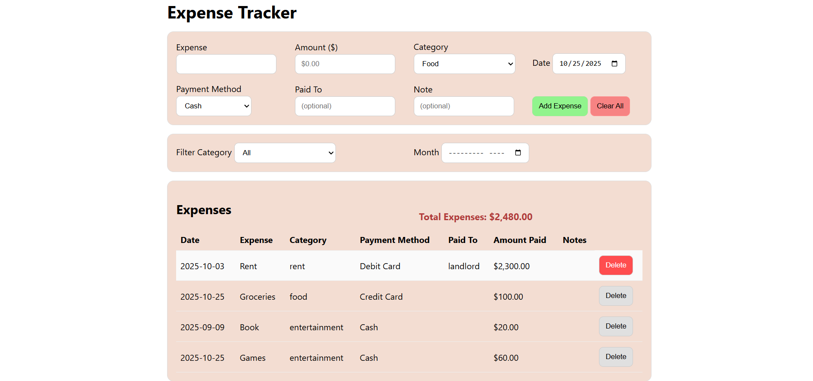
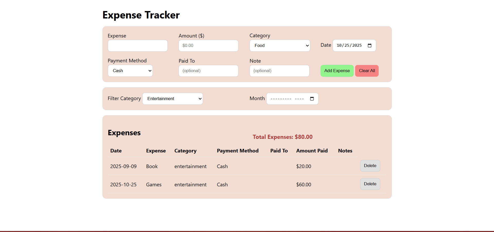

# TypeScript Expense Tracker

A mini expense tracker built with **TypeScript** to practice type safety, DOM manipulation, and localStorage.

---

## Live Demo

**▶ Try it now:** https://conorgregson.github.io/ts-expense-tracker

> Data is saved locally in your browser via `localStorage`

---

## About

This **expense tracker** is a simple web application for recording and managing personal expenses. It was developed as a mini-project to strength my **TypeScript fundamentals**, focusing on strict typing, modular design, and clean DOM manipulation without frameworks.

The app allows users to add, filter, and delete expense, and stores all data locally using `localStorage`.

---

## Features

- Add new expenses with amount (in **USD**), category, date, payment method, optional paid to, and optional note
- Filter expenses by category and month
- Delete individual entries or clear all records (with confirmation prompt)
- Persistent data storage through `localStorage`
- Dynamic total expenses display
- Developed in TypeScript strict mode for safer, cleaner code

---

## Tech Stack

- **TypeScript** (strict mode enabled)
- **HTML5** and **CSS3**
- **localStorage**
- Compiled to **JavaScript** using `tsc -w`

---

## Project Structure

```bash
ts-expense-tracker/
│
├── src/
│   ├── main.ts
│   ├── storage.ts
│   └── types.ts
│
├── build/
│   └── js/
│       ├── main.js
│       ├── storage.js
│       └── types.js
│
├── images/
│   ├── main-ui.png
│   ├── expenses-table-populated.png
│   └── filtered-expenses.png
│
├── index.html
├── styles.css
├── tsconfig.json
├── README.md
├── .gitignore
└── .gitattributes
```

---

## Getting Started

1. **Clone the repository**:

```bash
git clone https://github.com/yourusername/ts-expense-tracker.git
cd ts-expense-tracker
```

2. **Compile the TypeScript files**:

```bash
tsc -w
```

3. Open `index.html` in your browser or launch with Live Server in VS Code.

---

## Screenshots

### Main UI

The main interface where users can add, view, and manage expenses.


### Expense Table (populated)

Displays a list of recorded expenses with category, payment method, and total calculation.


### Filtered Expenses

Shows how users can filter by category or month to view specific spending.


---

## Learning Focus

This mini-project helped me practice:

- Creating and using TypeScript interfaces and types
- Manipulating the DOM with strong typing and event saftey
- Managing app state and persistent storage in a type-safe way
- Structuring a small project across multiple modules (`main.ts`, `storage.ts`, `types.ts`)
- Setting up a lightweight TypeScript build workflow

---

## Known Limitations and Future Improvements

This project was designed as a **learning exercise**, so a few features were intentionally simplified.
Below are potential enhancements for future versions:

- **Persistent data model**:
  - Current version uses `localStroage`. This mini-project could be upgraded to `IndexedDB` or a simple Node/Express backend for larger datasets.
- **Responsive layout**:
  - The interface is currently optimized for desktop. Adding mobile-friendly styling with responsive tables or cards would imporve usability
- **Editable rows**:
  - Expensed can be deleted, but not edited. Adding inline edit functionality would make the tracker more flexible.
- **Input validation**:
  - Current version relies on browser validation. Stronger TypeScript form validation would enhance data integrity
- **Currency Formatting**:
  - Extend support for multiple currencies or local-based formatting using the `Intl.NumberFormat` API.
- **Dark mode toggle**:
  - An optional theme switcher for better accessibility and user preference.

---

## Author

Made by Conor Gregson

- [GitHub](https://github.com/conorgregson)
- [LinkedIn](https://www.linkedin.com/in/conorgregson)

---

## License

This project is open-source and available under the **MIT License**. See the [LICENSE](/LICENSE) file for details.
