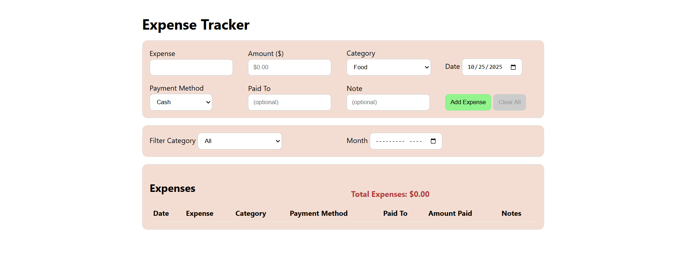

# TypeScript Expense Tracker

A simple, browser-based expense tracker built with **TypeScript**, designed to practice type safety, DOM manipulation, and localStorage.

[](https://conorgregson.github.io/ts-quiz-app)


---

### Tech Stack Overview

#### Core


### API & Tools


---

## Live Demo

**▶ Try it now:** https://conorgregson.github.io/ts-expense-tracker

> Data is saved locally in your browser via `localStorage`

---

## About

This **Expense Tracker** is a simple web application for recording and managing personal expenses.

It was developed as a mini-project to strength my **TypeScript fundamentals**, focusing on strict typing, modular design, and clean DOM manipulation without frameworks.

The app allows users to add, filter, and delete expense, and stores all data locally using `localStorage`.

---

## Features

- Add new expenses with **amount** (in **USD**), **category**, **date**, **payment method**, optional **paid to**, and **note**
- Filter expenses by **category** and **month**
- Delete individual entries or **clear all** records (with confirmation prompt)
- Persistent data storage through `localStorage`
- Dynamic total expenses display
- Developed in **TypeScript strict mode** for safer, cleaner code

---

## Tech Stack

- **TypeScript** (strict mode enabled)
- **HTML5** and **CSS3**
- **LocalStorage API** (save expenses)
- **ES Modules** (browser-native imports)
- Compiled to JavaScript using `tsc -w`

---

## Project Structure

```bash
ts-expense-tracker/
│
├── src/                                   # TypeScript source files
│   ├── main.ts                            # Handles UI logic, events, and rendering
│   ├── storage.ts                         # Handles localStorage read/write functions
│   └── types.ts                           # Shared TypeScript interfaces & types
│
├── build/                                 # Compiled JavaScript output
│   └── js/
│       ├── main.js
│       ├── storage.js
│       └── types.js
│
├── images/                                # Screenshots
│   ├── main-ui.png
│   ├── expenses-table-populated.png
│   └── filtered-expenses.png
│
├── index.html                             # Main HTML file
├── styles.css                             # Base styling (cards, forms, tables)
├── tsconfig.json                          # TypeScript configuration
├── README.md                              # Project documentation
├── LICENSE.md                             # License documentation
├── .gitignore                             # Git ignore rules
└── .gitattributes                         # Text normalization
```

---

## Screenshots

### Main UI

The main interface where users can add, view, and manage expenses.



### Expense Table (populated)

Displays a list of recorded expenses with category, payment method, and total calculation.


### Filtered Expenses

Shows how users can filter by category or month to view specific spending.


---

## Learning Focus

This mini-project helped me practice:

- Creating and using TypeScript interfaces and types
- Manipulating the DOM with strong typing and event saftey
- Managing app state and persistent storage in a type-safe way
- Structuring a small project across multiple modules (`main.ts`, `storage.ts`, `types.ts`)
- Setting up a lightweight TypeScript build workflow

---

## Getting Started

1. **Clone the repository**:

```bash
git clone https://github.com/yourusername/ts-expense-tracker.git
cd ts-expense-tracker
```

2. **Compile the TypeScript files**:

```bash
tsc -w
```

3. **Start a local server**

- Open `index.html` in your browser or launch with Live Server in VS Code.

---

## Known Limitations and Future Improvements

This project was designed as a **learning exercise**, so a few features were intentionally simplified.
Below are potential enhancements for future versions:

- **Persistent data model**:
  - Replace `localStorage` with IndexedDB or a lightweight backend (Node/Express).
- **Responsive layout**:
  - Improve mobile layout using media queries or CSS grid cards.
- **Editable rows**:
  - Add inline editing for existing entries.
- **Input validation**:
  - Strengthen data validation using TypeScript form checks.
- **Currency Formatting**:
  - Add multi-currency support using `Intl.NumberFormat` API.
- **Dark mode toggle**:
  - Optional accessibility and personalization feature.

---

## Author

Made by Conor Gregson

- [GitHub](https://github.com/conorgregson)
- [LinkedIn](https://www.linkedin.com/in/conorgregson)

---

## License

This project is open-source and available under the **MIT License**. See the [LICENSE](/LICENSE) file for details.
